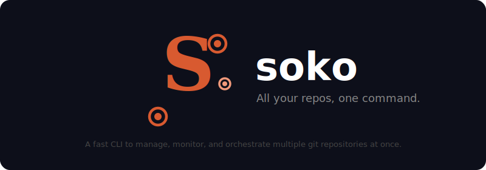

<p align="center">
  
</p>

<p align="center">
  <strong>All your repos, one command.</strong>
</p>

---

soko (倉庫 — "storehouse") is a fast, zero-dependency CLI for managing multiple git repositories. Register your repos once, then see the status of all of them from anywhere with a single command. No more `cd`-ing between directories and running `git status` one at a time.

## Prerequisites

- **Git** — soko shells out to `git` for all repository operations
- **Go 1.22+** — only needed if installing from source or via `go install`

## Quick start

```bash
# Install
go install github.com/CelikE/soko/cmd/soko@latest

# Register your repos (optionally with tags)
cd ~/projects/auth-service && soko init --tag backend
cd ~/projects/backend-api  && soko init --tag backend
cd ~/projects/frontend     && soko init --tag frontend

# See everything at a glance
soko status
```

```
  REPO               BRANCH       STATUS       ↑↓         LAST COMMIT
  ────────────────────────────────────────────────────────────────────────
  auth-service       feat/sso     ✎ 3M         ↑2         2h ago
  backend-api        main         ✓ clean      ↓3         1d ago
  frontend           dev          ✎ 1M 2U      ↑1         4h ago

  3 repos │ 2 dirty │ 1 behind remote │ 6 uncommitted changes
```

## Commands

| Command | Description |
|---------|-------------|
| `soko init` | Register the current git repo |
| `soko status` | Show status of all registered repos |
| `soko list` | List all registered repos |
| `soko remove` | Remove a repo from the registry |
| `soko fetch` | Fetch all registered repos in parallel |
| `soko cd` | Print the path of a repo for quick navigation |
| `soko exec` | Run a command in all registered repos |
| `soko tag` | Manage repo tags (add, remove, list) |
| `soko doc` | Check the health of your soko setup |
| `soko version` | Print the soko version |

## Flags

| Flag | Scope | Description |
|------|-------|-------------|
| `--json` | Global | Output in JSON format |
| `--fetch` | `status` | Fetch from remotes before showing status |
| `--dirty` | `status` | Show only repos with uncommitted changes |
| `--clean` | `status` | Show only clean repos in sync with remote |
| `--ahead` | `status` | Show only repos ahead of remote |
| `--behind` | `status` | Show only repos behind remote |
| `--tag` | `init`, `status`, `list`, `fetch`, `exec` | Filter by tag (repeatable, combines with OR) |
| `--prune` | `fetch` | Pass `--prune` to git fetch to clean up stale refs |
| `--seq` | `exec` | Run sequentially instead of in parallel |
| `--fix` | `doc` | Auto-fix issues (remove stale paths) |

## Usage examples

### Status with filters

```bash
soko status                         # all repos
soko status --fetch                 # fetch first, then show status
soko status --dirty                 # only repos with uncommitted changes
soko status --tag backend --behind  # only backend repos behind remote
soko status --json                  # machine-readable output
```

### Tags

```bash
soko init --tag backend --tag go    # tag during registration
soko tag add auth-service critical  # tag an existing repo
soko tag remove auth-service critical
soko tag list                       # show all tags with repo counts
soko status --tag backend           # filter any command by tag
soko fetch --tag frontend           # fetch only frontend repos
soko exec --tag go -- go mod tidy   # run in tagged repos only
```

### Run commands across repos

```bash
soko exec -- git pull --rebase      # pull all repos
soko exec -- git stash              # stash everything
soko exec -- make test              # run tests everywhere
soko exec --seq -- git log -1       # sequential, one at a time
soko exec --tag backend -- go vet   # only in backend repos
```

### Quick navigation

```bash
cd $(soko cd auth)                  # jump to auth-service
soko cd auth --json                 # get path as JSON
```

Add to your `.bashrc` or `.zshrc` for even faster navigation:

```bash
s() { local dir; dir=$(soko cd "$@") && cd "$dir"; }
```

Then use `s auth` to jump to the auth-service repo.

### Manage repos

```bash
soko list                           # show all registered repos
soko list --tag infra               # filter by tag
soko remove old-project             # unregister by name
soko remove --path /old/path        # unregister by path
soko remove --all --force           # clear everything
```

### Health check

```bash
soko doc                            # check for stale paths, missing git, etc.
soko doc --fix                      # auto-remove stale entries
```

## Configuration

soko stores registered repos in a single YAML file:

```
~/.config/soko/config.yaml
```

Respects `$XDG_CONFIG_HOME` if set. The format is minimal:

```yaml
repos:
  - name: auth-service
    path: /home/dev/work/auth-service
    tags:
      - backend
      - go
  - name: frontend
    path: /home/dev/work/frontend
    tags:
      - frontend
```

Tags are optional — repos without tags work the same as before.

## Building from source

```bash
git clone https://github.com/CelikE/soko.git
cd soko
make build
make test
```

## License

[MIT](LICENSE)
